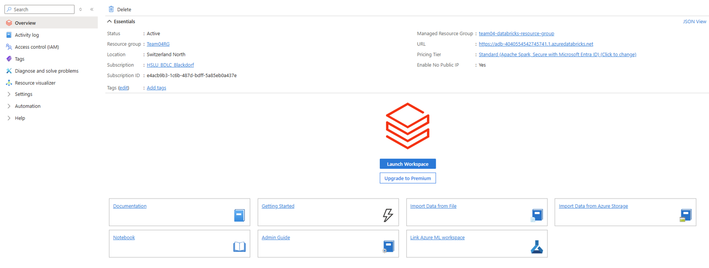

# Cloud project using Azure, Azure Databricks & Power BI

This repository contains the full Azure-based project developed for comparing national food prices between Kazakhstan and Afghanistan.  
The solution integrates **Azure Data Factory**, **Databricks**, **Data Lake Gen2**, and **Power BI**.

## Repository Structure
- `/databricks_notebooks`: Spark-based ETL and enrichment notebooks
- `/powerbi`: PBIX dashboard
- `/docs`: SLA, and possible Pricing List

## Key Features
- Automated ingestion from WFP datasets
- Bronze/Silver/Gold architecture using Delta Lake Gen2
- Interactive dashboards in Power BI
- SLA definitions for availability and performance

---

## 1. Create Azure Account and Resource Group  
1. Sign up or log into the [Azure Portal](https://portal.azure.com/).  
2. Create a **Resource Group** in your desired region (e.g., `Switzerland North`).  
3. All following resources will be created inside this group.  

---

## 2. Create Storage Account (Data Lake)  
1. In the Resource Group, create a **Storage Account**.  
2. Important: enable **Hierarchical Namespace** → this ensures that the storage account is a **Data Lake Gen2**.  

  

---

## 3. Set up Data Lake Containers  
1. Open the new Storage Account.  
2. Create a **Container** (e.g., `fooddata`).  
3. Inside the container, create three directories:  
   - `Bronze`  
   - `Silver`  
   - `Gold`  

  

---

## 4. Create Azure Databricks Workspace  
1. In the Resource Group, create an **Azure Databricks Service**.  
2. Launch it and click **Launch Workspace**.  

  

3. Inside the workspace, create a **Compute (Cluster)**. This step is essential to run Spark jobs.  

  

---

## 5. Upload Dataset (Kaggle)  
1. Download the dataset: [Global Food Prices on Kaggle](https://www.kaggle.com/datasets/jboysen/global-food-prices).  
2. In Databricks Workspace → click **New → Add or Upload Data**.  

  

3. Upload the dataset (e.g., into `Legacy Products`).  
4. Under **Settings → Advanced → DBFS File Browser**, enable **On**.  

  

---

## 6. App Registration for Storage Access  
To allow Databricks to access the Azure Storage Account:  

1. Go to **Azure Active Directory → App Registrations → New Registration**.  

  

2. Open the registration and note down:  
   - **Display Name**  
   - **Directory ID (Tenant ID)**  
   - **Application ID (Client ID)**  

---

## 7. Configure Access in Databricks  
In a Databricks Notebook, set up the connection:  

```python
storage_account = "YOUR_STORAGE_ACCOUNT_NAME"
application_id = "YOUR_APPLICATION_ID"
directory_id   = "YOUR_DIRECTORY_ID"
secret_key     = "YOUR_SECRET_KEY"

spark.conf.set(f"fs.azure.account.auth.type.{storage_account}.dfs.core.windows.net", "OAuth")
spark.conf.set(f"fs.azure.account.oauth.provider.type.{storage_account}.dfs.core.windows.net", "org.apache.hadoop.fs.azurebfs.oauth2.ClientCredsTokenProvider")
spark.conf.set(f"fs.azure.account.oauth2.client.id.{storage_account}.dfs.core.windows.net", application_id)
spark.conf.set(f"fs.azure.account.oauth2.client.secret.{storage_account}.dfs.core.windows.net", secret_key)
spark.conf.set(f"fs.azure.account.oauth2.client.endpoint.{storage_account}.dfs.core.windows.net", f"https://login.microsoftonline.com/{directory_id}/oauth2/token")
```

---

## 8. Create Client Secret

In the **App Registration** → go to **Certificates & Secrets** → click **New Client Secret**.  
Copy the **Value** (this will be your `secret_key`).  

  

---

## 9. Assign IAM Role to App Registration  

1. Open the **Storage Account** → Containers → **Access Control (IAM)**.  
2. Click **Add role assignment**.  

  

3. Select the role **Storage Blob Data Contributor**.  
4. Assign it to the **App Registration Display Name**.  

  

---

## 10. Run Databricks Notebooks  

Now **Databricks has full access** to your Storage Account.  

- Run the provided notebooks in `/databricks_notebooks/`.  
- Adapt the **connector paths** to match your own environment.  
- If the Bronze layer path (Read from catalog) does not match, copy the correct path from the **Catalog**.  

  

---

## Next Steps  

- Explore transformations in **Silver** and **Gold** layers.  
- Connect the **Gold tables** to Power BI for dashboards.  
- Review project docs in `/Files` (SRS, SLA).  

---


## How to Reproduce
1. Deploy Azure services using templates in `/azure_pipelines`.
2. Import notebooks into Databricks from `/databricks_notebooks`.
3. Connect processed data to Power BI via Lakehouse.
